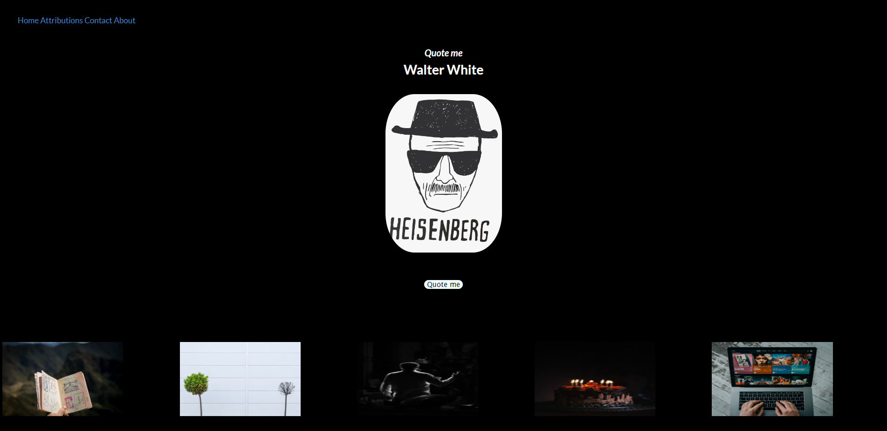

# Quote-Me-Walter-White

## Project Description

Our project is a website that allows users to generate quotes from the series Breaking Bad. This allows enthusiasts to use these quotes on their social media platforms or share them with friends. The main challenge we faced came from finding a suitable API that we could utilise to perform the desired function. An additional challenge was finding another API that worked efficiently with our initial API.
We were able to overcome this through searching different API’s and their functions. Once we found API’s that worked closely with our plan, we were able to adapt them and make minor changes so that the website worked efficiently.

The second API was a search engine for TV series' that allows users to input the title of the series, and the webpage would return the relevant series, image and plot. 
 
Moreover, since this was our first collaborative project we faced challenges navigating the command line to ensure each member was working on the latest version of the files.
We sought help from our instructors, and we are still trying to develop our understanding on this.

## User Story
As a Breaking Bad fan
I Want to be reminded of different quotes from the show
So that I use them with friends

## Acceptance Criteria
Given a quote generator website
When I click the generator button
Then I am presented with a quote from Breaking Bad
When I view the website
Then I see images and a theme that reflect the subject of Breaking Bad
When I view the navbar
Then I see four functioning links
When I click on any of them
Then I am directed to the corresponding part of the page
When I view the footer
Then I am able to see information about the developers

## Bugs

Merge Conflict with CSS - Resolved

## URL

## Github URL

https://github.com/jsmall4/Quote-Me-Walter-White

# Mock Up

<section>
    
</section>

## License

MIT 

## Contributors

Laura-Kam

haiderali1998

jsmall4

Hamdiyusuf

## Resources

www.breakingbadapi.com

https://api.tvmaze.com/search/shows

www.unsplash.com
